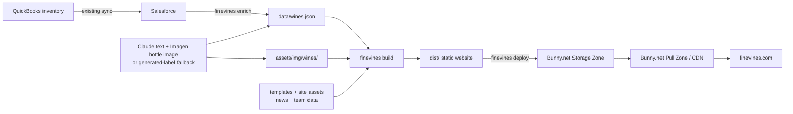

# FineVines Website

Source for [finevines.com](https://finevines.com) — a static, SEO-first website with a self-updating wine
catalog, built for FineVines, a licensed wholesale wine/liquor distributor in Illinois.

For the full architecture and confirmed scope, see
[`docs/superpowers/specs/2026-07-03-finevines-static-site-design.md`](docs/superpowers/specs/2026-07-03-finevines-static-site-design.md).
**If you're FineVines staff running the site day to day, you want
[`docs/operations.md`](docs/operations.md) instead — this README is for developers.**

## Current status

The website generator and the four-command pipeline are implemented in this repository. The checked-in
`data/wines.json` currently contains a **34-wine demo catalog** generated by `tools/demoseed`; it is not the live
FineVines catalog.

Before the first live catalog run, the provisional Salesforce object and field API names in
`internal/salesforce/client.go` must be checked against the FineVines Salesforce organization, especially the
field containing the QuickBooks-synced stock quantity. The Bunny.net zones, credentials, domain, and production
cutover also need to be configured and verified. The flow below describes the implemented solution, not proof
that the new site is already live in production.

## Solution at a glance



The four commands in the dependency-free Go program are:

```text
finevines enrich     Salesforce -> data/wines.json + assets/img/wines/*   (network, incremental, checkpointed)
finevines build      data + templates + assets -> dist/*                  (local, deterministic, no network)
finevines redirects  old-site crawl -> redirects.json                     (--publish uses Bunny Edge Scripting)
finevines deploy     dist/* -> Bunny.net Storage Zone + CDN cache purge   (network, hash-diff upload)
```

## 1. The website itself

This is a static, SEO-first website. It does not need a database or application server at request time.

- `templates/` contains the Go HTML templates for the home, portfolio, individual wine, News & Events, About,
  and Contact pages.
- `assets/` contains the CSS, browser JavaScript, fonts, general images, and generated wine images.
- `data/wines.json`, `data/news/*.json`, `data/team.json`, and `data/site.json` are the structured content inputs.
- `internal/build/build.go` reads those inputs and generates the complete publishable site in `dist/`, including
  the HTML pages, client-side catalog search index, sitemap, robots file, and static assets.
- `dist/` is generated output. It is the only website tree sent to Bunny.net and should not be edited by hand.

The public catalog is informational: e-commerce, customer accounts, and online ordering are not part of this
solution.

## 2. Hosting and deployment with Bunny.net

Bunny.net provides two layers:

1. The **Storage Zone** is the origin that stores the generated files from `dist/`.
2. The **Pull Zone** is the CDN in front of that storage. It serves the files to visitors through
   `finevines.com` and caches them at Bunny.net edge locations.

`finevines deploy` is implemented by `internal/deploy/`. It compares the current `dist/` file hashes with
`.bunny-manifest.json`, uploads new or changed files, deletes files that no longer belong on the site, saves the
new manifest, and then purges the Pull Zone cache so visitors receive the new version. A no-change deployment
does not upload or purge anything.

The normal on-demand or scheduled entry point is `deploy.bat`:

```text
finevines.exe enrich
finevines.exe build
finevines.exe deploy
```

The batch file stops when any command fails. If enrichment or the build fails, deployment is never started. If
a Bunny file operation fails during deployment, the manifest is not advanced and the CDN is not purged, so the
next run can safely retry; some files may already have reached the storage origin before that retry. If only
the final cache purge fails, the files are uploaded but visitors may temporarily receive cached content.

Production deploys also require `contactConfirmed` and `teamEmailsConfirmed` to be `true` in `data/site.json`.
This prevents candidate contact or roster details from reaching `finevines.com` before client approval. A staging
deploy remains available by setting `FINEVINES_SITE_BASE_URL` to the staging URL.

Old-site URL preservation is a separate launch concern. `finevines redirects` creates `redirects.json`, and
`finevines redirects --publish` publishes the large redirect map through Bunny.net Edge Scripting so legacy
URLs can return permanent redirects to their new locations.

## 3. Current process for getting the wine list

There are two important meanings of "current":

- **Current repository data:** `data/wines.json` contains a 34-wine demo catalog for local design and build
  work. `go run ./tools/demoseed` recreates it. A real `finevines enrich` run will replace this demo data.
- **Production data flow:** FineVines continues maintaining inventory in QuickBooks. The existing integration
  syncs the relevant product and inventory fields into Salesforce. This solution reads Salesforce—not
  QuickBooks Desktop directly—through Salesforce's HTTPS API and OAuth connected-app credentials.

`internal/salesforce/client.go` authenticates with Salesforce, runs a paginated SOQL roster query, and maps each
row into the raw wine structure used by enrichment. `internal/enrich/rules.go` then applies the confirmed
website rule:

```text
show the wine when stockQty > 0 AND the SKU does not start with "9"
```

The Salesforce query currently expects product identity, SKU, producer, name, vintage, varietal, region,
appellation, style, and stock quantity. Its object and field API names are intentionally marked provisional
until they are verified against the real organization. `data/wines.json` is a generated catalog cache and
build input, not the inventory source of truth; it should not be edited manually.

## 4. Data enrichment

Enrichment is incremental rather than regenerating the full catalog every night:

1. Fetch the candidate wine roster from Salesforce and remove ineligible rows.
2. Compute a SHA-256 `sourceHash` from each wine's raw Salesforce fields.
3. Compare those hashes with the existing `data/wines.json`.
4. Keep unchanged wines without API cost; enrich new or changed wines; remove wines no longer present or
   eligible.
5. For each wine being enriched, ask Claude for a grounded tasting description, sommelier notes, and an image
   prompt based on the available source fields.
6. Send the image prompt to Google's Imagen API. If image generation is rejected or unavailable, generate a
   deterministic wine-branded SVG label instead. A manually supplied producer image is preserved.
7. Save the resulting wine records to `data/wines.json` and their images under `assets/img/wines/`.

The initial live run may process the entire catalog. Later runs process only the differences. Work is performed
with a bounded worker pool and checkpointed every 50 completed wines so an interrupted run can resume without
repeating all completed enrichment.

### Code that performs enrichment

| Path | Responsibility |
|---|---|
| `cmd/finevines/main.go` | Validates configuration, creates the live clients, and starts `enrich.Run`. |
| `internal/salesforce/client.go` | Salesforce OAuth, paginated SOQL query, and raw field mapping. |
| `internal/enrich/run.go` | Orchestrates filtering, diffing, concurrent enrichment, checkpointing, and final output. |
| `internal/enrich/rules.go` | Applies the stock and SKU web-eligibility rule. |
| `internal/enrich/hash.go` and `diff.go` | Detect new, changed, unchanged, and removed wines. |
| `internal/enrich/text.go` | Calls Claude and validates the description, sommelier notes, and image prompt. |
| `internal/enrich/imagen.go` and `images.go` | Calls Imagen, stores bottle images, preserves supplied images, and selects the fallback. |
| `internal/label/label.go` | Generates the deterministic SVG wine-label fallback. |
| `internal/model/model.go` | Defines the JSON contract and atomically reads/writes `data/wines.json`. |

## 5. How enriched data flows back into the online website

Enrichment does not edit a live page or send data directly to Bunny.net. The handoff is deliberately split
into three stages:

1. **Enrich:** update the local structured catalog in `data/wines.json` and wine images in
   `assets/img/wines/`.
2. **Build:** `finevines build` combines that enriched catalog with the templates, shared assets, news, and
   team data. It regenerates `dist/portfolio/index.html`, one `dist/wines/<slug>/index.html` page per wine,
   `dist/search-index.json`, and the rest of the static site.
3. **Deploy:** `finevines deploy` synchronizes the changed `dist/` files to Bunny.net Storage and purges the
   Pull Zone cache.

Only after all three stages complete does the public website reflect the latest successful catalog run. A wine
that becomes eligible appears after the next successful cycle; a wine that becomes ineligible is omitted from
the rebuilt catalog and its obsolete page is deleted from Bunny.net during deployment.

`data/wines.json` is machine-owned by `enrich`. `data/news/` and `data/team.json` are human-owned through the
two Claude Code skills in `plugins/finevines-news` and `plugins/finevines-team`. `data/site.json` owns shared
contact details, their client-confirmation state, and homepage wine curation. All four feed the same build and
deploy path, but the website build itself never talks to Salesforce or an AI service.

## 6. The automated pipeline (GitHub Actions)

Since 2026-07-29 the publish path runs unattended in GitHub Actions rather than
from one Windows machine. `.github/workflows/pipeline.yml` runs on every push to
`master`, nightly at 08:15 UTC (about 2:15am Central), on manual dispatch, and
on a `repository_dispatch` of type `review-console` fired by the review console.
Runs queue rather than overlap.

Each run, in this order:

1. **`finevines applyqueue`** drains `_review/queue.json` from the Bunny storage
   zone: image swaps, text corrections, and flags submitted by reviewers. Every
   applied action ID is recorded in `data/queue-ledger.json`, so a crashed or
   re-fired run never applies the same correction twice.
2. **`finevines enrich`** pulls the live Salesforce roster. Unchanged wines are
   skipped by their `sourceHash`, so nothing is re-sent to OpenAI.
3. **`tools/labelfetch/cistage.sh`** sources bottle photographs for wines that
   have none and are due per `data/image-attempts.json` (a 30-day backoff after a
   failed search) — **up to 150 wines and 120 minutes per night**, whichever comes
   first. The cap is what makes the stage converge: each night records its
   results, a recorded miss is not retried for 30 days, so the due set shrinks and
   coverage climbs run over run instead of one unbounded run hitting the job
   timeout and losing everything it learned. An image must pass **both** the
   label/shape verification and the watermark sweep to be imported; there is no
   override in CI, and an image the sweep could not reach a verdict on is refused
   too.
4. **`finevines build`** renders `dist/`.
5. **`finevines deploy`** uploads the changed files to Bunny.net and purges both
   pull zones.
6. **A bot commit** returns `data/`, the imported photographs under
   `assets/img/wines/`, and `.bunny-manifest.json` to `master` with the message
   `pipeline: nightly run [skip ci]`. The repo remains the source of truth and
   every automated change is auditable in git history.
7. **`finevines notify`** emails a digest through the client's SMTP relay — but
   only if the run changed something. It lists new wines, delistings, rewritten
   notes, newly imported photographs (with thumbnails and their source URLs),
   corrections applied, and the portfolio's coverage figures, each linking to
   the live page.

`.github/workflows/ci.yml` is the separate, credential-free gate that runs on
every push and pull request: build, `go test ./...`, the Node unit tests, and a
mock-mode (`FINEVINES_SF_MOCK`) pipeline run that never touches Salesforce,
OpenAI or Bunny.net.

### Secrets to configure

All are GitHub Actions **repository** secrets (Settings → Secrets and variables →
Actions). The repo is public, so the pipeline workflow deliberately has no
`pull_request` trigger — a fork PR can never reach any of these.

| Secret | What it is |
| --- | --- |
| `FINEVINES_SF_BASE_URL` | Salesforce instance URL |
| `FINEVINES_SF_CLIENT_ID` | Connected App consumer key |
| `FINEVINES_SF_CLIENT_SECRET` | Connected App consumer secret |
| `OPENAI_API_KEY` | Enrichment, vision label reading, watermark sweep |
| `FINEVINES_BUNNY_STORAGE_ZONE` | Storage zone name |
| `FINEVINES_BUNNY_STORAGE_KEY` | Storage zone password |
| `FINEVINES_BUNNY_STORAGE_ENDPOINT` | Regional storage host |
| `FINEVINES_BUNNY_API_KEY` | Account API key (purge, Edge Scripting) |
| `FINEVINES_BUNNY_PULL_ZONE_ID` | Both pull zone IDs, comma-separated |
| `FINEVINES_BUNNY_SCRIPT_ID` | Redirect middleware's Edge Script ID |
| `FINEVINES_GA_ID` | GA4 measurement ID |
| `FINEVINES_SITE_BASE_URL` | Canonical site URL |
| `FINEVINES_SMTP_HOST` | Mail relay's submission host |
| `FINEVINES_SMTP_PORT` | 587 (STARTTLS) or 465 (implicit TLS) |
| `FINEVINES_SMTP_USER` | Relay SMTP AUTH username |
| `FINEVINES_SMTP_PASS` | Relay SMTP AUTH password |
| `FINEVINES_NOTIFY_TO` | Comma-separated digest recipients |
| `FINEVINES_NOTIFY_FROM` | Address the digest is sent from (relay-authorised, monitored) |
| `FINEVINES_REVIEW_HMAC_SECRET` | Magic-link signing key (used by the review console) |

The first eighteen are read directly out of `pipeline.yml`'s `env:` block.
`FINEVINES_REVIEW_HMAC_SECRET` is the nineteenth: nothing in this workflow reads
it yet — it is set up now because it belongs to the same secret inventory and
the review console (a separate, not-yet-built piece) will need it.

Also required once: **Settings → Actions → General → Workflow permissions** set
to **Read and write**, so the bot commit can push.

The review console's GitHub PAT is **not** a repository secret. It lives as a
Bunny Edge Script secret: fine-grained, this repo only, Actions: write for
`repository_dispatch` and nothing else.

## Building

Requires Go (see `go.mod` for the version). From the repo root:

```
go build -o finevines.exe ./cmd/finevines
```

For the actual release binary that ships to the FineVines machine, use the release flags (strips debug
symbols, smaller binary):

```
go build -ldflags "-s -w" -o finevines.exe ./cmd/finevines
```

This produces a single, dependency-free `finevines.exe` with no external DLLs. Running it with no arguments
prints usage; running any subcommand without its required `.env` values reports exactly which one is missing
rather than failing silently. The binary is a build artifact, not checked into the repo — see `.gitignore`.

Running the test suite:

```
go test ./...
```

## Running it

The pipeline normally runs itself — see **[6. The automated pipeline](#6-the-automated-pipeline-github-actions)**
above. To trigger it by hand: `gh workflow run pipeline.yml`, or the *Run
workflow* button on the Actions tab.

`deploy.bat` (repo root) remains the **local fallback** for when GitHub Actions
is unavailable or a run needs to be reproduced on a workstation. It runs
`enrich`, then `build`, then `deploy`, stopping at the first error. It does not
drain the review queue, source images, or send a digest — those are pipeline-only
steps. **Commit `data/` and `.bunny-manifest.json` after running it**, or the
next pipeline run will diff against stale state and re-upload the whole site.

See **[`docs/operations.md`](docs/operations.md)** for the full runbook: every
credential and where it comes from, running the pipeline by hand, reading a run's
summary output, what to do when a step fails, and how to install and use the two
Claude skills.

## Proprietary Notice

Copyright © 2026 FineVines. All rights reserved.

This repository contains proprietary website source code, designs, assets, content, branding, and related
materials for FineVines.

No license is granted. Public availability of this repository does not permit copying, reuse, modification,
distribution, publication, sublicensing, or creation of derivative works outside the limited functionality
provided by GitHub's platform.

Any use of this repository or its contents requires prior written permission from FineVines.
